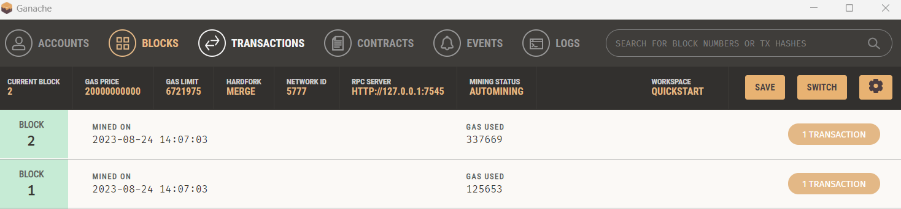

#### Deploiement sur ganache





#### Deploiement sur Sepolia :
```sol
0x96f509d9eb28c6efe2e20a1d438260b27d9dbe98c2622b86584e616959b8a945
```

#### Explications

Nous avons tout d'abord créer le projet via la cmd 
```
truffle unbox react
```

Ca nous a permis d'avoir notre structure de fichier.
Truffle contiendra tous nos contrats.
Client representera notre application web react

Ensuite nous avons créer notre contrat de mariage,
qui comportera la fonction "se marrier" et "divorcer".

Nous avons ensuite installé web3 côté client.
Désolé nous n'avons pas eu le temps de terminer
les explications.....